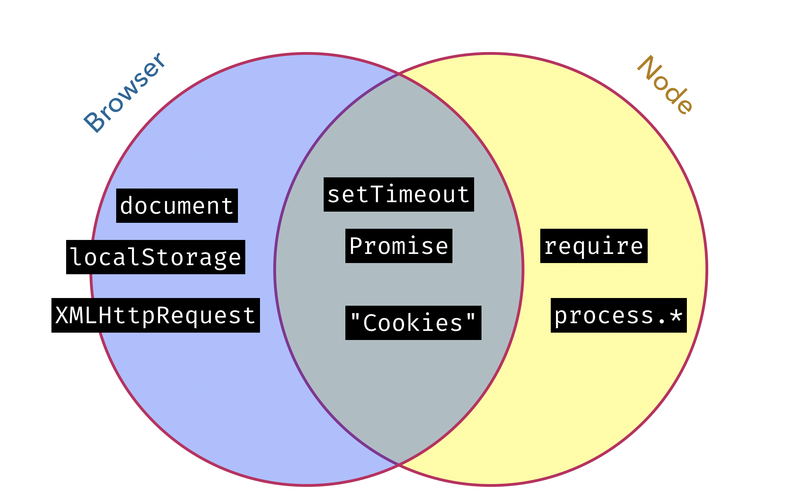

# Server Rendering with Fastboot

Ember's server rendering technology is called "Fastboot". Effectively, it's a small distributed system with one Node process that receives requests, and N workers, each of which maintains a "warm" ember app, ready to emit HTML for a given URL.

The idea is that you should _not_ be writing two apps (despite needing to run on two different environments). In order to do this, you'll need to stick to the _overlap_ of browser and Node.js APIs.



First, let's install fastboot to enable server-rendering

```
ember install ember-cli-fastboot
```

Open your [`config/environment.js`](../config/environment.js), and add a `fastboot` object as a top-level property of the `ENV` property you'll find there.

```diff
+    fastboot: {
+      hostWhitelist: [/localhost/],
+    },
     APP: {
```

We'll have to refactor our `auth` service so that it doesn't use any browser-specific APIs.

To do this we can install `ember-cookies`, a unified abstraction that can provide us with a way of dealing with cookies both in node and in a browser environment

```
ember install ember-cookies
```

Now let's stop and restart ember-cli -- we should see that the app is now being served with fastboot.
